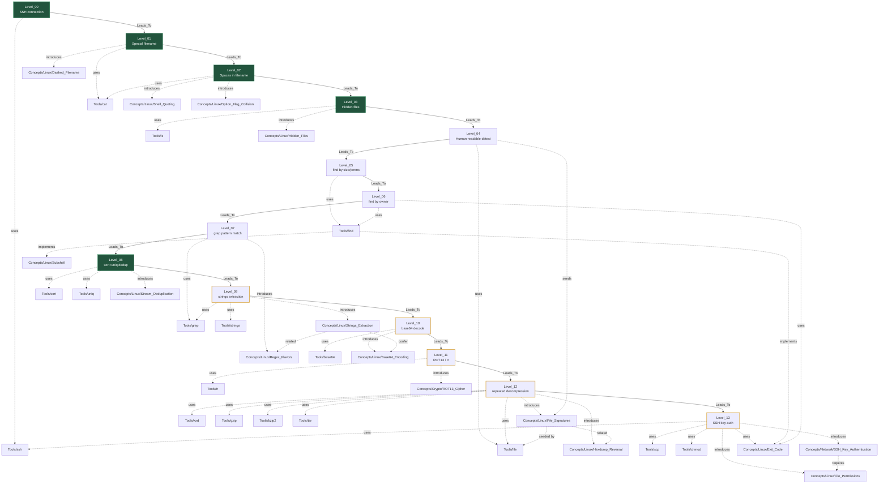

# MOC — OverTheWire Bandit

> Map of Content for Bandit wargame. Navigate via mermaid graph below.
> **Rule**: This file MUST contain ZERO `[[Wiki_Links]]` outside of mermaid code blocks (graph hygiene).

## Concept Dependency Graph



> Legend: solid arrow = level progression, dashed arrow = uses tool/introduces concept.
> Filled nodes = completed levels.

## Level Metadata Table

| Level | Title | Status | Difficulty | Time | Tools | New Concepts |
|---|---|---|---|---|---|---|
| 00 | SSH connection | 🟢 solid | ★☆☆ | 5min | ssh, cat, ls | SSH_Protocol |
| 01 | Filename `-` | 🟢 solid | ★☆☆ | 15min | cat, ls | Dashed_Filename |
| 02 | Filename `--spaces--` | 🟢 solid | ★☆☆ | 5min | cat, ls | Shell_Quoting, Option_Flag_Collision |
| 03 | Hidden file (`...`) | 🟢 solid | ★☆☆ | 5min | ls, cat | Hidden_Files |
| 04 | Human-readable file detect | 🔴 raw | ★☆☆ | — | file, find | File_Type_Detection |
| 05 | find by size + perms | 🔴 raw | ★★☆ | — | find | Find_Filters |
| 06 | find by owner/group | 🔴 raw | ★★☆ | — | find | Ownership_Filters |
| 07 | grep pattern match | 🔴 raw | ★☆☆ | 5min | grep | Regex_Flavors / Grep_Pattern_Matching |
| 08 | sort + uniq dedup | 🟢 solid | ★☆☆ | 5min | sort, uniq | Stream_Deduplication |
| 09 | strings extraction | 🟡 developing | ★☆☆ | 8min | strings, grep, xxd | Strings_Extraction |
| 10 | base64 decode | 🟡 developing | ★☆☆ | 3min | base64 | Base64_Encoding |
| 11 | ROT13 / tr | 🟡 developing | ★★☆ | 12min | tr, cat | ROT13_Cipher |
| 12 | repeated decompression | 🟡 developing | ★★☆ | 20min | xxd, file, gzip, bzip2, tar, mktemp | File_Signatures, Hexdump_Reversal |
| 13 | SSH key auth (private key) | 🟡 developing | ★★☆ | 15min | ssh, scp, chmod, cat | SSH_Key_Authentication, File_Permissions |

## Status Legend
- 🔴 raw — captured but not formally written
- 🟡 developing — partial writeup, missing phases
- 🟢 solid — complete 5-phase writeup, reviewed
- ⭐ mastered — flashcard-recall verified

## Foundational Concepts (general, cross-level)

| Concept | Status | Domain | First Introduced | Why It Matters |
|---|---|---|---|---|
| Subshell | 🟡 developing | Linux | chat-session 2026-05-28 | `( )` isolation, `$()`, pipeline subshell semantics — 모든 shell scripting의 hidden mechanic |
| Exit_Code | 🟡 developing | Linux | chat-session 2026-05-28 | `$?`, `set -e`, `pipefail`, signal coalescing (`128+N`) — control flow의 atomic unit |

## Foundational Tools (general, cross-level)

| Tool | Status | Category | First Used | Mastery Level |
|---|---|---|---|---|
| find | 🟡 developing | file-discovery | Level_05 | Tool reference 작성됨 (`Tools/find.md`) |

## Progress

```
[############                   ] 14/34 level notes written (00–13)
   └ 🟢 solid: 5 (00,01,02,03,08)   🟡 developing: 5 (09,10,11,12,13)   🔴 raw: 4 (04,05,06,07)
Concept Atoms: 7 written (Subshell, Exit_Code, Regex_Flavors, Strings_Extraction, Base64_Encoding, File_Signatures, SSH_Key_Authentication[Network])
Tool References: 3 written (find, sort, uniq)
Pending atoms (dangling): ROT13_Cipher, Stream_Deduplication, Pipe_Composition, Hexdump_Reversal, File_Permissions, Asymmetric_Cryptography, Digital_Signature
Pending tools (dangling): strings, grep, xxd, base64, tr, ssh, scp, chmod, ssh-keygen, cat, file, gzip, bzip2, tar, mktemp
```

## Update Protocol

When a new Level note is created:
1. Add node to mermaid graph (above)
2. Add edges (Leads_To from previous, dotted edges to tools/concepts introduced)
3. Append row to metadata table
4. Update progress bar
5. `last_updated` frontmatter field
