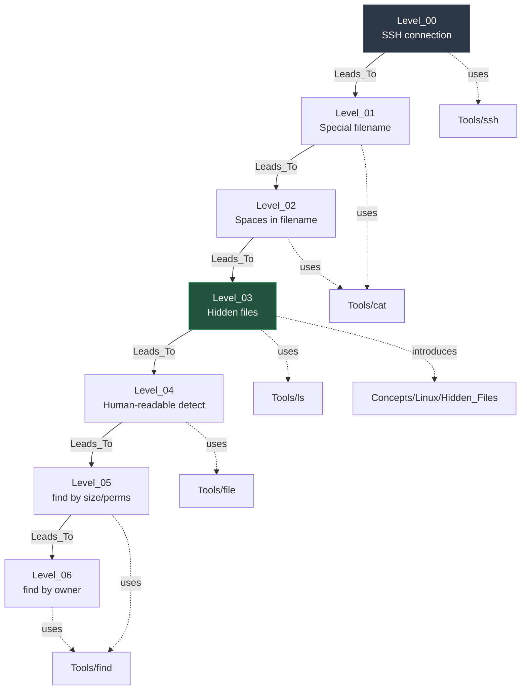

# MOC — OverTheWire Bandit

> Map of Content for Bandit wargame. Navigate via mermaid graph below.
> **Rule**: This file MUST contain ZERO `[[Wiki_Links]]` outside of mermaid code blocks (graph hygiene).

## Concept Dependency Graph



> Legend: solid arrow = level progression, dashed arrow = uses tool/introduces concept.
> Filled nodes = completed levels.

## Level Metadata Table

| Level | Title | Status | Difficulty | Time | Tools | New Concepts |
|---|---|---|---|---|---|---|
| 00 | SSH connection | 🔴 raw | ★☆☆ | — | ssh | — |
| 01 | Filename `-` | 🔴 raw | ★☆☆ | — | cat | special-files |
| 02 | Filename with spaces | 🔴 raw | ★☆☆ | — | cat | shell-escaping |
| 03 | Hidden file | 🔴 raw | ★☆☆ | — | ls | Hidden_Files |
| 04 | Human-readable file detect | 🔴 raw | ★☆☆ | — | file, find | File_Type_Detection |
| 05 | find by size + perms | 🔴 raw | ★★☆ | — | find | Find_Filters |
| 06 | find by owner/group | 🔴 raw | ★★☆ | — | find | Ownership_Filters |

## Status Legend
- 🔴 raw — captured but not formally written
- 🟡 developing — partial writeup, missing phases
- 🟢 solid — complete 5-phase writeup, reviewed
- ⭐ mastered — flashcard-recall verified

## Progress

```
[                              ] 0/34 levels complete
```

## Update Protocol

When a new Level note is created:
1. Add node to mermaid graph (above)
2. Add edges (Leads_To from previous, dotted edges to tools/concepts introduced)
3. Append row to metadata table
4. Update progress bar
5. `last_updated` frontmatter field
