# MOC — OverTheWire Bandit

> Map of Content for Bandit wargame. Navigate via mermaid graph below.
> **Rule**: This file MUST contain ZERO `[[Wiki_Links]]` outside of mermaid code blocks (graph hygiene).

## Concept Dependency Graph

```mermaid
graph TD
    L00[Level_00<br/>SSH connection]
    L01[Level_01<br/>Special filename]
    L02[Level_02<br/>Spaces in filename]
    L03[Level_03<br/>Hidden files]
    L04[Level_04<br/>Human-readable detect]
    L05[Level_05<br/>find by size/perms]
    L06[Level_06<br/>find by owner]
    L07[Level_07<br/>grep pattern match]
    L08[Level_08<br/>sort+uniq dedup]
    L09[Level_09<br/>strings extraction]
    L10[Level_10<br/>base64 decode]
    L11[Level_11<br/>ROT13 / tr]
    L12[Level_12<br/>repeated decompression]
    L13[Level_13<br/>SSH key auth]
    L14[Level_14<br/>netcat TCP client]
    L15[Level_15<br/>SSL/TLS submit]
    L16[Level_16<br/>port scan + SSL key]
    L17[Level_17<br/>file diff]
    L18[Level_18<br/>.bashrc trap / ssh cmd]
    L19[Level_19<br/>setuid privesc]
    L20[Level_20<br/>client-server nc]
    L21[Level_21<br/>cron world-readable dump]
    L22[Level_22<br/>cron md5 filename]
    L23[Level_23<br/>cron script injection]
    L24[Level_24<br/>brute-force PIN]
    L25[Level_25<br/>restricted shell escape]
    L26[Level_26<br/>setuid env-wrapper]
    L27[Level_27<br/>git clone over SSH]
    L28[Level_28<br/>git history secret]
    L29[Level_29<br/>git branch secret]
    L30[Level_30<br/>git tag secret]
    L31[Level_31<br/>git push / pre-receive]
    L32[Level_32<br/>UPPERCASE shell $0]

    L00 -->|Leads_To| L01
    L01 -->|Leads_To| L02
    L02 -->|Leads_To| L03
    L03 -->|Leads_To| L04
    L04 -->|Leads_To| L05
    L05 -->|Leads_To| L06
    L06 -->|Leads_To| L07
    L07 -->|Leads_To| L08
    L08 -->|Leads_To| L09
    L09 -->|Leads_To| L10
    L10 -->|Leads_To| L11
    L11 -->|Leads_To| L12
    L12 -->|Leads_To| L13
    L13 -->|Leads_To| L14
    L14 -->|Leads_To| L15
    L15 -->|Leads_To| L16
    L16 -->|Leads_To| L17
    L17 -->|Leads_To| L18
    L18 -->|Leads_To| L19
    L19 -->|Leads_To| L20
    L20 -->|Leads_To| L21
    L21 -->|Leads_To| L22
    L22 -->|Leads_To| L23
    L23 -->|Leads_To| L24
    L24 -->|Leads_To| L25
    L25 -->|Leads_To| L26
    L26 -->|Leads_To| L27
    L27 -->|Leads_To| L28
    L28 -->|Leads_To| L29
    L29 -->|Leads_To| L30
    L30 -->|Leads_To| L31
    L31 -->|Leads_To| L32

    L00 -.->|uses| T_SSH[Tools/ssh]
    L01 -.->|uses| T_CAT[Tools/cat]
    L01 -.->|introduces| C_DASH[Concepts/Linux/Dashed_Filename]
    L02 -.->|uses| T_CAT
    L02 -.->|introduces| C_QUOTE[Concepts/Linux/Shell_Quoting]
    L02 -.->|introduces| C_OPT[Concepts/Linux/Option_Flag_Collision]
    L03 -.->|uses| T_LS[Tools/ls]
    L03 -.->|introduces| C_HIDDEN[Concepts/Linux/Hidden_Files]
    L04 -.->|uses| T_FILE[Tools/file]
    L05 -.->|uses| T_FIND[Tools/find]
    L06 -.->|uses| T_FIND
    L07 -.->|uses| T_GREP[Tools/grep]
    L07 -.->|introduces| C_REGEX[Concepts/Linux/Regex_Flavors]
    L08 -.->|uses| T_SORT[Tools/sort]
    L08 -.->|uses| T_UNIQ[Tools/uniq]
    L08 -.->|introduces| C_DEDUP[Concepts/Linux/Stream_Deduplication]
    L09 -.->|uses| T_STRINGS[Tools/strings]
    L09 -.->|uses| T_GREP
    L09 -.->|introduces| C_STRINGS[Concepts/Linux/Strings_Extraction]
    L10 -.->|uses| T_B64[Tools/base64]
    L10 -.->|introduces| C_B64[Concepts/Linux/Base64_Encoding]
    L11 -.->|uses| T_TR[Tools/tr]
    L11 -.->|introduces| C_ROT13[Concepts/Crypto/ROT13_Cipher]
    L12 -.->|uses| T_XXD[Tools/xxd]
    L12 -.->|uses| T_FILE
    L12 -.->|uses| T_GZIP[Tools/gzip]
    L12 -.->|uses| T_BZIP2[Tools/bzip2]
    L12 -.->|uses| T_TAR[Tools/tar]
    L12 -.->|introduces| C_SIG[Concepts/Linux/File_Signatures]
    L12 -.->|introduces| C_HEXREV[Concepts/Linux/Hexdump_Reversal]
    L13 -.->|uses| T_SSH
    L13 -.->|uses| T_SCP[Tools/scp]
    L13 -.->|uses| T_CHMOD[Tools/chmod]
    L13 -.->|introduces| C_SSHKEY[Concepts/Network/SSH_Key_Authentication]
    L13 -.->|introduces| C_FILEPERM[Concepts/Linux/File_Permissions]
    L13 -.->|uses| C_EXITCODE
    L14 -.->|uses| T_NC[Tools/nc]
    L14 -.->|uses| T_CAT
    L14 -.->|introduces| C_NETCAT[Concepts/Network/Netcat]
    L14 -.->|reapplies| C_STDINARG[Concepts/Linux/Stdin_Vs_Argument]
    L06 -.->|seeds| C_STDINARG
    L10 -.->|reapplies| C_STDINARG
    L15 -.->|introduces| C_SSLTLS[Concepts/Network/SSL_TLS]
    L15 -.->|uses| T_OPENSSL[Tools/openssl]
    L15 -.->|reapplies| C_NETCAT
    L16 -.->|introduces| C_PORTSCAN[Concepts/Network/Port_Scanning]
    L16 -.->|uses| T_NMAP[Tools/nmap]
    L16 -.->|reapplies| C_SSLTLS
    L16 -.->|reapplies| C_SSHKEY
    L17 -.->|introduces| C_FILEDIFF[Concepts/Linux/File_Diff]
    L17 -.->|uses| T_DIFF[Tools/diff]
    L17 -.->|reapplies| C_DEDUP
    L18 -.->|introduces| C_SHELLINIT[Concepts/Linux/Shell_Initialization]
    L18 -.->|uses| T_SSH
    L19 -.->|introduces| C_SETUID[Concepts/Linux/Setuid]
    L19 -.->|reapplies| C_FILEPERM
    L20 -.->|introduces| C_CLISRV[Concepts/Network/Client_Server_Model]
    L20 -.->|introduces| C_PRIVPORT[Concepts/Network/Privileged_Ports]
    L20 -.->|reapplies| C_NETCAT
    L20 -.->|reapplies| C_SETUID
    L21 -.->|introduces| C_CRON[Concepts/Linux/Cron]
    L21 -.->|introduces| C_SCHEDPRIV[Concepts/Linux/Scheduled_Task_Privilege]
    L21 -.->|uses| T_CAT
    L21 -.->|uses| T_CRONTAB[Tools/crontab]
    L21 -.->|reapplies| C_FILEPERM
    L21 -.->|reapplies| C_SETUID
    L22 -.->|introduces| C_MD5[Concepts/Crypto/Md5_Hashing]
    L22 -.->|introduces| C_DETFN[Concepts/Linux/Deterministic_Filename]
    L22 -.->|uses| T_MD5SUM[Tools/md5sum]
    L22 -.->|uses| T_CUT[Tools/cut]
    L22 -.->|reapplies| C_CRON
    L22 -.->|reapplies| C_FILEPERM
    L23 -.->|introduces| C_CONFDEP[Concepts/Linux/Confused_Deputy]
    L23 -.->|introduces| C_CRONINJ[Concepts/Linux/Cron_Script_Injection]
    L23 -.->|uses| T_MKTEMP[Tools/mktemp]
    L23 -.->|uses| T_PRINTF[Tools/printf]
    L23 -.->|uses| T_STAT[Tools/stat]
    L23 -.->|uses| T_CHMOD
    L23 -.->|reapplies| C_CRON
    L23 -.->|reapplies| C_FILEPERM
    L23 -.->|reapplies| C_SETUID
    L24 -.->|introduces| C_BRUTE[Concepts/Security/Brute_Force_Search]
    L24 -.->|introduces| C_BATCH[Concepts/Network/Connection_Batching]
    L24 -.->|uses| T_NC
    L24 -.->|uses| T_SORT
    L24 -.->|uses| T_UNIQ
    L24 -.->|reapplies| C_NETCAT
    L24 -.->|reapplies| C_SHELLFUND[Concepts/Linux/Shell_Fundamentals]
    L25 -.->|introduces| C_RSHELL[Concepts/Linux/Restricted_Shell_Escape]
    L25 -.->|uses| T_SSH
    L25 -.->|uses| T_MORE[Tools/more]
    L25 -.->|uses| T_VI[Tools/vi]
    L25 -.->|uses| T_CAT
    L25 -.->|reapplies| C_SSHKEY
    L25 -.->|reapplies| C_SHELLFUND
    L25 -.->|reapplies| C_SHELLINIT
    L26 -.->|reapplies| C_SETUID
    L26 -.->|reapplies| C_STRINGS
    L26 -.->|introduces| C_TRIAGE[Concepts/Linux/Static_Binary_Triage]
    L26 -.->|uses| T_FILE
    L26 -.->|uses| T_STRINGS
    L26 -.->|uses| T_CAT
    L26 -.->|uses| T_ID[Tools/id]
    L26 -.->|reapplies| C_FILEPERM
    L26 -.->|requires| L25
    L27 -.->|introduces| C_GITSSH[Concepts/Network/Git_Over_SSH]
    L27 -.->|uses| T_GIT[Tools/git]
    L27 -.->|uses| T_SSH
    L27 -.->|uses| T_CAT
    L27 -.->|uses| T_TREE[Tools/tree]
    L27 -.->|reapplies| C_SSHKEY
    L27 -.->|reapplies| C_SHELLFUND
    L27 -.->|requires| L26
    L28 -.->|introduces| C_GITOBJ[Concepts/Linux/Git_Object_Model]
    L28 -.->|uses| T_GIT
    L28 -.->|reapplies| C_GITSSH
    L29 -.->|reapplies| C_GITOBJ
    L29 -.->|reapplies| C_GITSSH
    L29 -.->|uses| T_GIT
    L30 -.->|reapplies| C_GITOBJ
    L30 -.->|reapplies| C_GITSSH
    L30 -.->|uses| T_GIT
    L31 -.->|introduces| C_GITHOOK[Concepts/Linux/Git_Server_Side_Hooks]
    L31 -.->|reapplies| C_GITOBJ
    L31 -.->|reapplies| C_GITSSH
    L31 -.->|uses| T_GIT
    L31 -.->|uses| T_VI
    L32 -.->|reapplies| C_RSHELL
    L32 -.->|reapplies| C_SETUID
    L32 -.->|reapplies| C_SHELLFUND
    L32 -.->|uses| T_FILE
    L32 -.->|uses| T_CAT
    L23 -.->|reapplies| C_SHELLFUND
    C_SSHKEY -.->|requires| C_FILEPERM
    C_STRINGS -.->|related| C_REGEX
    C_STRINGS -.->|confer| C_B64
    C_SIG -.->|related| C_HEXREV
    C_SIG -.->|seeded by| T_FILE
    L04 -.->|seeds| C_SIG

    %% Foundational concepts (general-purpose, not tied to single level)
    C_SUBSHELL[Concepts/Linux/Subshell]
    C_EXITCODE[Concepts/Linux/Exit_Code]
    T_FIND -.->|implements| C_SUBSHELL
    T_FIND -.->|implements| C_EXITCODE
    L06 -.->|uses| C_EXITCODE

    click L00 "Wargames/Bandit/Level_00.md"
    click L01 "Wargames/Bandit/Level_01.md"
    click L02 "Wargames/Bandit/Level_02.md"
    click L03 "Wargames/Bandit/Level_03.md"
    click L04 "Wargames/Bandit/Level_04.md"
    click L05 "Wargames/Bandit/Level_05.md"
    click L06 "Wargames/Bandit/Level_06.md"
    click L07 "Wargames/Bandit/Level_07.md"
    click L08 "Wargames/Bandit/Level_08.md"
    click L09 "Wargames/Bandit/Level_09.md"
    click L10 "Wargames/Bandit/Level_10.md"
    click L11 "Wargames/Bandit/Level_11.md"
    click L12 "Wargames/Bandit/Level_12.md"
    click L13 "Wargames/Bandit/Level_13.md"
    click L14 "Wargames/Bandit/Level_14.md"
    click L15 "Wargames/Bandit/Level_15.md"
    click L16 "Wargames/Bandit/Level_16.md"
    click L17 "Wargames/Bandit/Level_17.md"
    click L18 "Wargames/Bandit/Level_18.md"
    click L19 "Wargames/Bandit/Level_19.md"
    click L20 "Wargames/Bandit/Level_20.md"
    click L21 "Wargames/Bandit/Level_21.md"
    click L22 "Wargames/Bandit/Level_22.md"
    click L23 "Wargames/Bandit/Level_23.md"
    click L24 "Wargames/Bandit/Level_24.md"
    click L25 "Wargames/Bandit/Level_25.md"
    click L26 "Wargames/Bandit/Level_26.md"
    click L27 "Wargames/Bandit/Level_27.md"
    click L28 "Wargames/Bandit/Level_28.md"
    click L29 "Wargames/Bandit/Level_29.md"
    click L30 "Wargames/Bandit/Level_30.md"
    click L31 "Wargames/Bandit/Level_31.md"
    click L32 "Wargames/Bandit/Level_32.md"

    %% Filled = 🟢 solid; outlined = 🟡 developing / 🔴 raw
    style L00 fill:#22543d,stroke:#38a169,color:#fff
    style L01 fill:#22543d,stroke:#38a169,color:#fff
    style L02 fill:#22543d,stroke:#38a169,color:#fff
    style L03 fill:#22543d,stroke:#38a169,color:#fff
    style L06 fill:#22543d,stroke:#38a169,color:#fff
    style L08 fill:#22543d,stroke:#38a169,color:#fff
    style L09 fill:#22543d,stroke:#38a169,color:#fff
    style L10 fill:#22543d,stroke:#38a169,color:#fff
    style L11 fill:#22543d,stroke:#38a169,color:#fff
    style L12 fill:#22543d,stroke:#38a169,color:#fff
    style L13 fill:#22543d,stroke:#38a169,color:#fff
    style L14 stroke:#d69e2e,stroke-width:2px
    style L15 stroke:#d69e2e,stroke-width:2px
    style L16 stroke:#d69e2e,stroke-width:2px
    style L17 stroke:#d69e2e,stroke-width:2px
    style L18 stroke:#d69e2e,stroke-width:2px
    style L19 stroke:#d69e2e,stroke-width:2px
    style L20 stroke:#d69e2e,stroke-width:2px
    style L21 stroke:#d69e2e,stroke-width:2px
    style L22 stroke:#d69e2e,stroke-width:2px
    style L23 stroke:#d69e2e,stroke-width:2px
    style L24 stroke:#d69e2e,stroke-width:2px
    style L25 stroke:#d69e2e,stroke-width:2px
    style L26 stroke:#d69e2e,stroke-width:2px
    style L27 stroke:#d69e2e,stroke-width:2px
    style L28 stroke:#d69e2e,stroke-width:2px
    style L29 stroke:#d69e2e,stroke-width:2px
    style L30 stroke:#d69e2e,stroke-width:2px
    style L31 stroke:#d69e2e,stroke-width:2px
    style L32 stroke:#d69e2e,stroke-width:2px
```



> Legend: solid arrow = level progression, dashed arrow = uses tool/introduces concept.
> Filled nodes = completed levels.

## Level Metadata Table

| Level | Title | Status | Difficulty | Time | Tools | New Concepts |
|---|---|---|---|---|---|---|
| 00 | SSH connection | 🟢 solid | ★☆☆ | 5min | ssh, cat, ls | SSH_Protocol |
| 01 | Filename `-` | 🟢 solid | ★☆☆ | 15min | cat, ls | Dashed_Filename |
| 02 | Filename `--spaces--` | 🟢 solid | ★☆☆ | 5min | cat, ls | Shell_Quoting, Option_Flag_Collision |
| 03 | Hidden file (`...`) | 🟢 solid | ★☆☆ | 5min | ls, cat | Hidden_Files |
| 04 | Human-readable file detect | 🔴 raw | ★☆☆ | — | file, find | File_Type_Detection |
| 05 | find by size + perms | 🔴 raw | ★★☆ | — | find | Find_Filters |
| 06 | find by owner/group | 🟢 solid | ★☆☆ | 20min | find, cat | Stderr_Redirection, Shell_History_Expansion |
| 07 | grep pattern match | 🔴 raw | ★☆☆ | 5min | grep | Regex_Flavors / Grep_Pattern_Matching |
| 08 | sort + uniq dedup | 🟢 solid | ★☆☆ | 5min | sort, uniq | Stream_Deduplication |
| 09 | strings extraction | 🟢 solid | ★☆☆ | 8min | strings, grep, xxd | Strings_Extraction |
| 10 | base64 decode | 🟢 solid | ★☆☆ | 3min | base64 | Base64_Encoding |
| 11 | ROT13 / tr | 🟢 solid | ★★☆ | 12min | tr, cat | ROT13_Cipher |
| 12 | repeated decompression | 🟢 solid | ★★☆ | 20min | xxd, file, gzip, bzip2, tar, mktemp | File_Signatures, Hexdump_Reversal |
| 13 | SSH key auth (private key) | 🟢 solid | ★★☆ | 15min | ssh, scp, chmod, cat | SSH_Key_Authentication, File_Permissions |
| 14 | netcat TCP client | 🟡 developing | ★☆☆ | 12min | nc, cat, echo | Netcat |
| 15 | SSL/TLS submit (openssl s_client) | 🟡 developing | ★★☆ | 8min | openssl | SSL_TLS |
| 16 | port scan → SSL → key | 🟡 developing | ★★★ | 30min | nmap, openssl, ssh, chmod | Port_Scanning |
| 17 | file diff (passwords) | 🟡 developing | ★☆☆ | 10min | diff, sort, uniq, grep, mktemp | File_Diff |
| 18 | .bashrc trap / ssh cmd | 🟡 developing | ★★☆ | 5min | ssh, cat | Shell_Initialization |
| 19 | setuid privesc (do-wrapper) | 🟡 developing | ★★☆ | 5min | whoami, cat, find | Setuid |
| 20 | client-server nc (suconnect) | 🟡 developing | ★★★ | 15min | nc, tmux, printf | Client_Server_Model, Privileged_Ports |
| 21 | cron world-readable /tmp dump | 🟡 developing | ★★☆ | 10min | cat, cron, chmod | Cron, Scheduled_Task_Privilege |
| 22 | cron md5-derived filename | 🟡 developing | ★★☆ | 12min | cat, cron, md5sum, cut | Md5_Hashing, Deterministic_Filename |
| 23 | cron script injection (confused deputy) | 🟡 developing | ★★★ | 45min | cron, mktemp, printf, chmod, stat, id | Confused_Deputy, Cron_Script_Injection |
| 24 | brute-force 4-digit PIN (nc batching) | 🟡 developing | ★★☆ | 20min | nc, bash-loop, sort, uniq | Brute_Force_Search, Connection_Batching |
| 25 | restricted shell escape (more→vi) | 🟡 developing | ★★★ | 40min | ssh, more, vi, cat | Restricted_Shell_Escape |
| 26 | setuid env-wrapper (bandit27-do) | 🟡 developing | ★★☆ | 10min | file, cat, id, whoami | — (reapplies Setuid; env-wrapper + file/strings triage) |
| 27 | git clone over SSH (non-std port) | 🟡 developing | ★★☆ | 15min | git, ssh, cat, tree | Git_Over_SSH (URL authority/port, upload-pack, secrets-in-VCS) |
| 28 | git history secret (verify-pack) | 🟡 developing | ★★☆ | 12min | git, cat, tree | Git_Object_Model (blob/tree/commit/tag, content-addressable, pack/delta, reachability) |
| 29 | git branch secret (remote-tracking) | 🟡 developing | ★★☆ | 10min | git, cat, tree | — (reapplies Git_Object_Model; branch/remote-tracking ref) |
| 30 | git tag secret (lightweight tag) | 🟡 developing | ★★★ | 12min | git, cat, tree | — (reapplies Git_Object_Model; lightweight vs annotated tag) |
| 31 | git push / pre-receive hook | 🟡 developing | ★★★ | 20min | git, vi, cat, tree | Git_Server_Side_Hooks (push write-path, pre-receive gate/quarantine, gitignore add -f) |
| 32 | UPPERCASE shell escape ($0) | 🟡 developing | ★★☆ | 10min | file, cat | — (reapplies Restricted_Shell_Escape + Setuid; $0 filter-invariant, setuid sticky-uid) |

## Status Legend
- 🔴 raw — captured but not formally written
- 🟡 developing — partial writeup, missing phases
- 🟢 solid — complete 5-phase writeup, reviewed
- ⭐ mastered — flashcard-recall verified

## Foundational Concepts (general, cross-level)

| Concept | Status | Domain | First Introduced | Why It Matters |
|---|---|---|---|---|
| Subshell | 🟡 developing | Linux | chat-session 2026-05-28 | `( )` isolation, `$()`, pipeline subshell semantics — 모든 shell scripting의 hidden mechanic |
| Exit_Code | 🟡 developing | Linux | chat-session 2026-05-28 | `$?`, `set -e`, `pipefail`, signal coalescing (`128+N`) — control flow의 atomic unit |
| Shell_Fundamentals | 🟡 developing (lite) | Linux | Level_23 session 2026-07-15 | `=`할당/`$`확장/quote/fd·redirect/`2>&1`/heredoc/CRLF·shebang/`%`포맷/`chmod`/`install` — 모든 레벨의 shell 기저. 17항 Q&A lite 노트 |
| Setuid | 🟡 developing (lite) | Linux | Level_19 (deep-dived L32 session 2026-07-22) | RUID/EUID/saved-UID, setuid bit(04000), `setreuid` sticky uid, `bash -p` privilege drop — do-wrapper/privesc 기저 |
| Process_Creation | 🟡 developing (lite) | Linux | L32 EOL Q&A 2026-07-22 | fork/execve/waitpid, `system()`=`sh -c`, `$0`=argv0, exec vs nest, syscall/ABI/userland/architecture — "프로그램이 프로그램을 어떻게 실행하나" |
| Tty_And_Terminals | 🟡 developing (lite) | Linux | L32 EOL Q&A 2026-07-22 | tty/pty, foreground process group, isatty, interactive vs non-interactive — 키보드 독점(VM capture 직관) |

## Foundational Tools (general, cross-level)

| Tool | Status | Category | First Used | Mastery Level |
|---|---|---|---|---|
| find | 🟡 developing | file-discovery | Level_05 | Tool reference 작성됨 (`Tools/find.md`) |

## Progress

```
[#############################  ] 33/34 level notes written (00–32)
   └ 🟢 solid: 11 (00,01,02,03,06,08,09,10,11,12,13)   🟡 developing: 19 (14,15,16,17,18,19,20,21,22,23,24,25,26,27,28,29,30,31,32)   🔴 raw: 3 (04,05,07)
Concept Atoms: 7 full (Subshell, Exit_Code, Regex_Flavors, Strings_Extraction, Base64_Encoding, File_Signatures, SSH_Key_Authentication[Network]) + 9 lite (Shell_Fundamentals, Restricted_Shell_Escape, Setuid, Static_Binary_Triage, Git_Over_SSH[Network], Git_Object_Model, Git_Server_Side_Hooks, Process_Creation, Tty_And_Terminals)
Tool References: 4 written (find, sort, uniq, more)
Pending atoms (dangling): ROT13_Cipher, Stream_Deduplication, Pipe_Composition, Hexdump_Reversal, File_Permissions, Asymmetric_Cryptography, Digital_Signature, Netcat, Stdin_Vs_Argument, SSL_TLS, Port_Scanning, File_Diff, Shell_Initialization, Client_Server_Model, Privileged_Ports, Cron, Scheduled_Task_Privilege, Md5_Hashing, Deterministic_Filename, Confused_Deputy, Cron_Script_Injection, Brute_Force_Search, Connection_Batching
Pending tools (dangling): strings, grep, xxd, base64, tr, ssh, scp, chmod, ssh-keygen, cat, file, gzip, bzip2, tar, mktemp, nc, echo, openssl, nmap, diff, tmux, printf, whoami, crontab, md5sum, cut, stat, id, vi, git, tree
```

## Update Protocol

When a new Level note is created:
1. Add node to mermaid graph (above)
2. Add edges (Leads_To from previous, dotted edges to tools/concepts introduced)
3. Append row to metadata table
4. Update progress bar
5. `last_updated` frontmatter field
