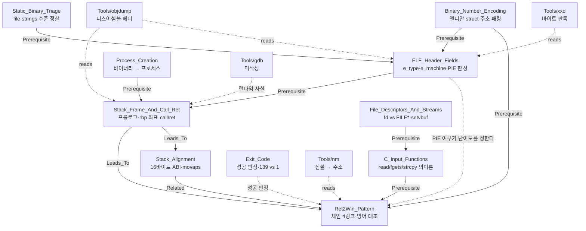

# MOC — Binary Exploitation (stack & control flow)

> 이것은 **주제 MOC**다 — 특정 워게임이 아니라 *개념군* 단위. 출처 일부가 no-publish 트리라
> 공개 워게임 MOC 에 걸 수 없다는 사정도 [[_MOC/MOC_Binary_Formats]] 와 같다.
>
> Theme: **제어 흐름은 메모리에 적힌 주소로 결정된다.**
> `MOC_Binary_Formats` 가 *데이터 파일의 선언 vs 실측*을 다루는 것과 대비된다 — 이쪽은
> *프로세스의 코드·스택·레지스터*다. 두 스코프는 `Binary_Number_Encoding` 을 공유 전제로만
> 접한다.
>
> **Rule**: 이 파일은 mermaid 코드 블록 **밖에서** `[[Wiki_Links]]` 를 쓰지 않는다 (그래프 위생).
> **Rule**: 문제명·플래그·오프셋·주소는 이 파일과 공개 `Concepts/` 에 들어오지 않는다.

## Concept Dependency Graph

> Legend — 실선 `-->` = Prerequisite/Leads_To, 점선 `-.->` = uses/reads/보조.
> `Tools/gdb` 는 **미작성이지만 그래프에 남긴다** — 미해결 to-do 를 지우면 to-do 가 사라진다.
> (같은 이유로 `MOC_Binary_Formats` 가 `Tools/strings` 를 남겨 두고 있다.)

## The Chain (핵심 프레임)

스택 BOF 로 제어 흐름을 가져가는 과정은 **네 개의 링크**다. 이 스코프의 모든 노트는
그 중 하나 이상에 대응하고, **각 방어 기제는 서로 다른 링크를 끊는다.**

| # | 링크 | 무엇이 일어나나 | 주로 쓰는 노트 | 이 링크를 끊는 방어 |
|---|---|---|---|---|
| 1 | **메모리 쓰기** | 버퍼를 넘쳐 저장된 복귀 주소를 덮는다 | C_Input_Functions, Stack_Frame_And_Call_Ret | (RELRO — GOT 변종) |
| 2 | **`ret` 도달** | 에필로그의 `ret` 이 실행된다 | Stack_Frame_And_Call_Ret | **Stack canary** |
| 3 | **RIP 적재** | `ret` 이 그 8바이트를 rip 에 넣는다 (무검증) | Stack_Frame_And_Call_Ret | — |
| 4 | **목적지 실행** | 그 주소의 코드가 돈다 | Ret2Win_Pattern, ELF_Header_Fields, Stack_Alignment | **PIE**(주소를 모른다) · **NX**(스택이면 실행 불가) |

> ⭐ **1~4를 하나로 뭉치면 방어를 분석할 수 없다.** "RIP를 오버플로한다"는 문장은 1·2·3을
> 하나로 접어 버리고, 그러면 canary(2)와 PIE(4)가 왜 전혀 다른 우회를 요구하는지 설명되지
> 않는다. 링크를 분리해 두는 것이 이 프레임의 유일한 목적이다.

## Concept Metadata Table

| Note | Domain | Tier | Status | Mastery | 담당 링크 | 핵심 |
|---|---|---|---|---|---|---|
| Stack_Frame_And_Call_Ret | Binary | lite | 🟡 | 55 | 1·2·3 | `call`/`ret`의 정의, `rbp` 좌표계, 성장 방향, arm64 대조 |
| Ret2Win_Pattern | Binary | lite | 🟡 | 50 | 4 | 체인 4링크, ret2X 가족, 방어 대조표 |
| Stack_Alignment | Binary | lite | 🟡 | 45 | 4 | 16바이트 ABI, `ret` 진입이 8 어긋남, `movaps` #GP |
| ELF_Header_Fields | Binary | lite | 🟡 | 45 | 4 | `e_type`→PIE, `EI_CLASS`→포인터 크기 |
| C_Input_Functions | Linux | lite | 🟡 | 50 | 1 | 멈추는 조건 / NUL 종료 / 바이트 자유도 |
| File_Descriptors_And_Streams | Linux | lite | 🟡 | 50 | (전제) | fd vs `FILE*`, `setvbuf`, isatty 버퍼링 |
| Binary_Number_Encoding | Binary | lite | 🟡 | 55 | 1 | 엔디안, `<Q` 패킹, 텍스트≠바이트 |
| Static_Binary_Triage | Linux | lite | 🟡 | 35 | (정찰) | `file`/`strings`/`nm` 순서 |
| Exit_Code | Linux | **full** | 🟢 | — | (판정) | `139` = 128+11 vs `exit(1)` |
| Process_Creation | Linux | lite | 🟡 | — | (전제) | 바이너리 → 프로세스, syscall/ABI |

## Tool Metadata Table

| Tool | Status | 이 스코프에서의 역할 |
|---|---|---|
| objdump | 🟢 | 디스어셈블·헤더·섹션. **LLVM판/GNU판 구분이 실무적으로 결정적** |
| nm | 🟢 | 심볼 → 주소. 호출되지 않는 함수는 여기에만 있다 |
| xxd | 🟢 | 헤더 바이트 판독 (`od`가 등가) |
| gdb | 🔴 미작성 | 런타임 사실 측정. x86-64 타깃 지원 필요(`gdb-multiarch`) |
| pwntools | 🔴 **의도적 미도입** | 손으로 하는 법을 익히는 동안 보류 — 자동화가 학습 대상을 가린다 |

## Status Legend

🔴 raw · 🟡 developing · 🟢 solid · ⭐ mastered

## Update Protocol

1. mermaid 에 노드 + `click` 경로 + 의존 화살표를 추가한다.
2. Concept / Tool Metadata Table 양쪽을 갱신한다.
3. **그 노트가 The Chain 의 어느 링크를 담당하는지 명시한다.** 어느 링크에도 해당하지
   않으면 이 스코프가 아니다 — 데이터 포맷 쪽이면 `MOC_Binary_Formats`.
4. `last_updated` 를 올린다.
5. 출처가 no-publish 트리면 **공개 노트에 그 경로를 링크하지 말 것** — `External:` 평문으로만
   표기한다. 문제명·플래그·오프셋·주소는 공개 `Concepts/` 에 들어오지 않는다.

## Links

- **선행 스코프**: External: `_MOC/MOC_Binary_Formats` (`Binary_Number_Encoding` 공유)
- **예정 노트** (다른 MOC 가 이미 이름을 예약해 둠): External:
  `Stack_Buffer_Overflow`, `Calling_Convention`, `Format_String_Bug`, `ROP`,
  `ASLR_NX_Canary`, `Shellcode` — 🔴 **이름 충돌 검토 필요.** 이번에 만든
  `Stack_Frame_And_Call_Ret` / `Ret2Win_Pattern` / `Stack_Alignment` 가 더 원자적이라 그대로
  두었으나, 예약된 이름들과 경계를 JY 가 정해야 한다.
- **다음 방향**: 방어 기제 판독(ELF 구조에서 NX/RELRO/canary 읽기) → canary 우회 →
  ret2libc → ROP
