# MOC — Binary Exploitation (stack & control flow)

> 이것은 **주제 MOC**다 — 특정 워게임이 아니라 *개념군* 단위. 출처 일부가 no-publish 트리라
> 공개 워게임 MOC 에 걸 수 없다는 사정도 [[_MOC/MOC_Binary_Formats]] 와 같다.
>
> Theme: **제어 흐름은 메모리에 적힌 주소로 결정된다.**
> `MOC_Binary_Formats` 가 *데이터 파일의 선언 vs 실측*을 다루는 것과 대비된다 — 이쪽은
> *프로세스의 코드·스택·레지스터*다. 두 스코프는 `Binary_Number_Encoding` 을 공유 전제로만
> 접한다.
>
> **Rule**: 이 파일은 mermaid 코드 블록 **밖에서** `[[Wiki_Links]]` 를 쓰지 않는다 (그래프 위생).
> **Rule**: 문제명·플래그·오프셋·주소는 이 파일과 공개 `Concepts/` 에 들어오지 않는다.

## Concept Dependency Graph

```mermaid
graph TD
    ENC[Binary_Number_Encoding<br/>엔디안·struct·주소 패킹]
    ELF[ELF_Header_Fields<br/>e_type·e_machine·PIE 판정]
    TRI[Static_Binary_Triage<br/>file·strings 수준 정찰]
    FRAME[Stack_Frame_And_Call_Ret<br/>프롤로그·rbp 좌표·call/ret]
    ALIGN[Stack_Alignment<br/>16바이트 ABI·movaps]
    R2W[Ret2Win_Pattern<br/>체인 4링크·방어 대조]
    FDS[File_Descriptors_And_Streams<br/>fd vs FILE*·setvbuf]
    CIN[C_Input_Functions<br/>read/fgets/strcpy 의미론]
    EXIT[Exit_Code<br/>성공 판정·139 vs 1]
    PROC[Process_Creation<br/>바이너리 → 프로세스]
    SC[Shellcode<br/>자족성·relocation 0·인코딩 제약]
    SYS[Syscall_Convention<br/>rax/rdi·r10·rcx·r11 파괴]
    SEC[ELF_Sections_And_Relocation<br/>두 헤더 표·relocation·.text 추출]
    PROT[Memory_Protections<br/>NX/canary/RELRO/PIE ↔ 네 구조]
    ROP[ROP<br/>가젯·바이트 단위 주소·슬롯 회계]
    R2L[Ret2Libc_Pattern<br/>base 역산·오프셋 좌표계·소거 진단]

    T_OBJ[Tools/objdump<br/>디스어셈블·헤더]
    T_NM[Tools/nm<br/>심볼 → 주소]
    T_XXD[Tools/xxd<br/>바이트 판독]
    T_GDB[Tools/gdb<br/>미작성]
    T_PWN[Tools/pwntools<br/>p64·remote·ELF.address]
    T_STR[Tools/strings<br/>문자열 → 파일 오프셋]

    TRI -->|Prerequisite| ELF
    PROC -->|Prerequisite| FRAME
    ELF -->|Prerequisite| FRAME
    ENC -->|Prerequisite| ELF
    FRAME -->|Leads_To| R2W
    FRAME -->|Leads_To| ALIGN
    ALIGN -->|Related| R2W
    CIN -->|Prerequisite| R2W
    FDS -->|Prerequisite| CIN
    ENC -->|Prerequisite| R2W
    EXIT -.->|성공 판정| R2W
    ELF -.->|PIE 여부가 난이도를 정한다| R2W
    ELF -->|Prerequisite| SEC
    SEC -->|Prerequisite| SC
    SYS -->|Prerequisite| SC
    FRAME -->|Related| SYS
    R2W -->|Leads_To| SC
    ELF -->|Prerequisite| PROT
    SEC -->|Prerequisite| PROT
    PROT -.->|어느 링크가 끊기나| R2W
    PROT -->|NX 꺼짐이 전제| SC
    ENC -->|Prerequisite| SC
    ALIGN -.->|syscall 경로는 무관| SC
    R2W -->|Leads_To| ROP
    ROP -->|Prerequisite| R2L
    PROT -->|NX 켜짐이 강제한다| ROP
    ALIGN -->|슬롯 홀짝| ROP
    ALIGN -.->|system 내부 movaps| R2L
    ELF -.->|e_type 이 st_value 의 의미를 정한다| R2L
    SEC -->|파일 오프셋 → vaddr| R2L
    SYS -.->|인자 레지스터 순서| ROP
    ENC -->|Prerequisite| R2L
    PROT -.->|ASLR 이 leak 을 강제한다| R2L

    T_OBJ -.->|reads| FRAME
    T_OBJ -.->|reads| ELF
    T_NM -.->|reads| R2W
    T_XXD -.->|reads| ELF
    T_GDB -.->|런타임 사실| FRAME
    T_OBJ -.->|reads| SEC
    T_OBJ -.->|reads| PROT
    T_NM -.->|canary 심볼| PROT
    T_PWN -.->|조립·전송| SC
    T_PWN -.->|조립·전송| R2W
    T_OBJ -.->|가젯 바이트| ROP
    T_NM -.->|libc 오프셋| R2L
    T_STR -.->|문자열 좌표| R2L
    T_STR -.->|정찰| TRI
    T_PWN -.->|ELF.address| R2L

    click ENC "../Concepts/Binary/Binary_Number_Encoding.md"
    click ELF "../Concepts/Binary/ELF_Header_Fields.md"
    click TRI "../Concepts/Linux/Static_Binary_Triage.md"
    click FRAME "../Concepts/Binary/Stack_Frame_And_Call_Ret.md"
    click ALIGN "../Concepts/Binary/Stack_Alignment.md"
    click R2W "../Concepts/Binary/Ret2Win_Pattern.md"
    click FDS "../Concepts/Linux/File_Descriptors_And_Streams.md"
    click CIN "../Concepts/Linux/C_Input_Functions.md"
    click EXIT "../Concepts/Linux/Exit_Code.md"
    click PROC "../Concepts/Linux/Process_Creation.md"
    click T_OBJ "../Tools/objdump.md"
    click T_NM "../Tools/nm.md"
    click T_XXD "../Tools/xxd.md"
    click SC "../Concepts/Binary/Shellcode.md"
    click SYS "../Concepts/Binary/Syscall_Convention.md"
    click SEC "../Concepts/Binary/ELF_Sections_And_Relocation.md"
    click PROT "../Concepts/Binary/Memory_Protections.md"
    click T_PWN "../Tools/pwntools.md"
    click ROP "../Concepts/Binary/ROP.md"
    click R2L "../Concepts/Binary/Ret2Libc_Pattern.md"
    click T_STR "../Tools/strings.md"
```

> Legend — 실선 `-->` = Prerequisite/Leads_To, 점선 `-.->` = uses/reads/보조.
> `Tools/gdb` 는 **미작성이지만 그래프에 남긴다** — 미해결 to-do 를 지우면 to-do 가 사라진다.
> (`Tools/strings` 는 **2026-09-29 작성됨** — `MOC_Binary_Formats` 쪽 미해결 링크도 함께 해소.)

## The Chain (핵심 프레임)

스택 BOF 로 제어 흐름을 가져가는 과정은 **네 개의 링크**다. 이 스코프의 모든 노트는
그 중 하나 이상에 대응하고, **각 방어 기제는 서로 다른 링크를 끊는다.**

| # | 링크 | 무엇이 일어나나 | 주로 쓰는 노트 | 이 링크를 끊는 방어 |
|---|---|---|---|---|
| 1 | **메모리 쓰기** | 버퍼를 넘쳐 저장된 복귀 주소를 덮는다 | C_Input_Functions, Stack_Frame_And_Call_Ret | (RELRO — GOT 변종) |
| 2 | **`ret` 도달** | 에필로그의 `ret` 이 실행된다 | Stack_Frame_And_Call_Ret | **Stack canary** |
| 3 | **RIP 적재** | `ret` 이 그 8바이트를 rip 에 넣는다 (무검증) | Stack_Frame_And_Call_Ret | — |
| 4 | **목적지 실행** | 그 주소의 코드가 돈다 | Ret2Win_Pattern, Shellcode, ROP, Ret2Libc_Pattern, Memory_Protections, ELF_Header_Fields, Stack_Alignment | **PIE**(주소를 모른다) · **NX**(스택이면 실행 불가) |
| **0** | **주소 확보 (leak)** | 목적지 주소를 실행 중에 알아낸다 | Ret2Libc_Pattern, Memory_Protections, Binary_Number_Encoding | **ASLR** — 그리고 이 링크를 *만드는* 것이 ASLR 이다 |

> **⓪ 는 2026-09-29 에 추가됐다.** ret2win 에는 없던 링크다 (주소가 파일에 고정). NX·ASLR 이
> 켜지면 ④ 의 목적지가 실행마다 움직이므로 **먼저 주소를 알아내는 단계**가 생긴다. 실전
> 문제의 난이도는 대체로 ④ 가 아니라 ⓪ 에 있다 — leak 이 공짜로 주어지는가, 스스로
> 2단계 체인으로 만들어야 하는가.

> ⭐ **1~4를 하나로 뭉치면 방어를 분석할 수 없다.** "RIP를 오버플로한다"는 문장은 1·2·3을
> 하나로 접어 버리고, 그러면 canary(2)와 PIE(4)가 왜 전혀 다른 우회를 요구하는지 설명되지
> 않는다. 링크를 분리해 두는 것이 이 프레임의 유일한 목적이다.

## Concept Metadata Table

| Note | Domain | Tier | Status | Mastery | 담당 링크 | 핵심 |
|---|---|---|---|---|---|---|
| Stack_Frame_And_Call_Ret | Binary | lite | 🟡 | 55 | 1·2·3 | `call`/`ret`의 정의, `rbp` 좌표계, 성장 방향, arm64 대조 |
| Ret2Win_Pattern | Binary | lite | 🟡 | 50 | 4 | 체인 4링크, ret2X 가족, 방어 대조표 |
| Stack_Alignment | Binary | lite | 🟡 | 45 | 4 | 16바이트 ABI, `ret` 진입이 8 어긋남, `movaps` #GP |
| ELF_Header_Fields | Binary | lite | 🟡 | 45 | 4 | `e_type`→PIE, `EI_CLASS`→포인터 크기 |
| C_Input_Functions | Linux | lite | 🟡 | 50 | 1 | 멈추는 조건 / NUL 종료 / 바이트 자유도 |
| File_Descriptors_And_Streams | Linux | lite | 🟡 | 50 | (전제) | fd vs `FILE*`, `setvbuf`, isatty 버퍼링 |
| Binary_Number_Encoding | Binary | lite | 🟡 | 55 | 1 | 엔디안, `<Q` 패킹, 텍스트≠바이트 |
| Static_Binary_Triage | Linux | lite | 🟡 | 35 | (정찰) | `file`/`strings`/`nm` 순서 |
| Exit_Code | Linux | **full** | 🟢 | — | (판정) | `139` = 128+11 vs `exit(1)` |
| Process_Creation | Linux | lite | 🟡 | — | (전제) | 바이너리 → 프로세스, syscall/ABI |
| Shellcode | Binary | lite | 🟡 | 50 | 4 | relocation 0 = 자족성, 인코딩/NUL 제약, C vs asm |
| Syscall_Convention | Binary | lite | 🟡 | 50 | 4 | syscall ABI, `r10`/`rcx`/`r11`, 번호는 arch별 |
| ELF_Sections_And_Relocation | Binary | lite | 🟡 | 45 | (전제) | 섹션 vs program header, relocation, `.text` 추출 |
| Memory_Protections | Binary | lite | 🟡 | 50 | 1·2·4 | 넷이 네 구조에 · GOT/RELRO 3단계 · ASLR≠PIE |
| ROP | Binary | lite | 🟡 | 50 | 4 | 가젯 = `ret` 로 끝나는 조각 · **CPU 는 바이트 단위로 디코드한다** · 슬롯 회계 |
| Ret2Libc_Pattern | Binary | lite | 🟡 | 50 | **0**·4 | base 역산 두 줄 · 오프셋은 빌드 상수 · 하위 12비트 불변 · 소거 진단 |

## Tool Metadata Table

| Tool | Status | 이 스코프에서의 역할 |
|---|---|---|
| objdump | 🟢 | 디스어셈블·헤더·섹션. **LLVM판/GNU판 구분이 실무적으로 결정적** |
| nm | 🟢 | 심볼 → 주소. 호출되지 않는 함수는 여기에만 있다 |
| xxd | 🟢 | 헤더 바이트 판독 (`od`가 등가) |
| gdb | 🔴 미작성 | 런타임 사실 측정. x86-64 타깃 지원 필요(`gdb-multiarch`) |
| strings | 🟢 **2026-09-29 신규** | 문자열 → **파일 오프셋**. `nm` 과 좌표계가 다르다는 것이 핵심 |
| pwntools | 🟡 **2026-09-28 도입** | `remote`/`recvline`/`p64`/`interactive`/`ELF().address`. 손으로 한 항목만 넘겼다 — `checksec`/`shellcraft`/자동 ROP 는 계속 제외 |

## Status Legend

🔴 raw · 🟡 developing · 🟢 solid · ⭐ mastered

## Update Protocol

1. mermaid 에 노드 + `click` 경로 + 의존 화살표를 추가한다.
2. Concept / Tool Metadata Table 양쪽을 갱신한다.
3. **그 노트가 The Chain 의 어느 링크를 담당하는지 명시한다.** 어느 링크에도 해당하지
   않으면 이 스코프가 아니다 — 데이터 포맷 쪽이면 `MOC_Binary_Formats`.
4. `last_updated` 를 올린다.
5. 출처가 no-publish 트리면 **공개 노트에 그 경로를 링크하지 말 것** — `External:` 평문으로만
   표기한다. 문제명·플래그·오프셋·주소는 공개 `Concepts/` 에 들어오지 않는다.

## Links

- **선행 스코프**: External: `_MOC/MOC_Binary_Formats` (`Binary_Number_Encoding` 공유)
- **예정 노트** (다른 MOC 가 이름을 예약해 둠): External: `Stack_Buffer_Overflow`,
  `Calling_Convention`, `Format_String_Bug` — 🟡 경계 미정.
  **2026-09-29: 예약명 `ROP` 는 같은 이름으로 채웠다** (+ 예약에 없던 `Ret2Libc_Pattern` 신설).
  **2026-09-28 부분 해소**: 예약명 `Shellcode` 는 같은 이름으로 **채웠고**, `ASLR_NX_Canary`
  는 RELRO·PIE 를 빠뜨리는 이름이라 `Memory_Protections` 로 만들었다. `Calling_Convention`
  은 `Stack_Frame_And_Call_Ret`(함수) + `Syscall_Convention`(커널) 둘로 쪼개져 있어 예약을
  해제해도 된다. 남은 판단: `Stack_Buffer_Overflow` 를 별도 노트로 둘지, 현재 4링크 프레임으로
  충분하다고 볼지.
- **다음 방향** (2026-09-29 갱신): ret2libc·ROP 완료. 남은 축 —
  ① **leak 을 스스로 만드는 법** (링크 ⓪: ret2plt 2단계, format string) ②
  **canary 우회** (leak / partial overwrite / fork brute force) ③ **PIE 우회**
  (partial overwrite, 코드 base leak) ④ `Format_String_Bug` 신규.
  방어 기제 판독은 `Memory_Protections` 로 완료.
