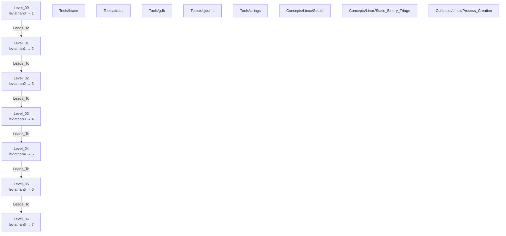

# MOC — OverTheWire Leviathan

> Map of Content for Leviathan. Bandit 졸업(0→34) 후 다음 게임 — "셸 쓰기"에서 "**바이너리 분석**"으로 넘어가는 관문.
> Theme: setuid 프로그램에서 비밀 추출 — `ltrace`/`strace`/`gdb`/`strings`/`objdump`. **C 불필요**(끝까지 no-programming). 8계정 leviathan0→7 = 7 전환(Level_00–06). 지시문 없음 → 목표 추론이 곧 훈련.
> **Rule**: This file MUST contain ZERO `[[Wiki_Links]]` outside of mermaid code blocks (graph hygiene).

## Concept Dependency Graph



> Legend: solid arrow = level progression, dashed arrow = uses tool/introduces concept (풀이 후 추가).
> Reused from Bandit graduation: `Setuid`(L19/26/32), `Static_Binary_Triage`(L26 file/strings/objdump), `Process_Creation`(fork/exec/$0).

## Level Metadata Table

| Level | Title | Status | Difficulty | Time | Tools | New Concepts |
|---|---|---|---|---|---|---|
| 00 | leviathan0 → 1 | 🔴 raw | — | — | — | — |
| 01 | leviathan1 → 2 | 🔴 raw | — | — | — | — |
| 02 | leviathan2 → 3 | 🔴 raw | — | — | — | — |
| 03 | leviathan3 → 4 | 🔴 raw | — | — | — | — |
| 04 | leviathan4 → 5 | 🔴 raw | — | — | — | — |
| 05 | leviathan5 → 6 | 🔴 raw | — | — | — | — |
| 06 | leviathan6 → 7 | 🔴 raw | — | — | — | — |

## Status Legend
- 🔴 raw — captured but not formally written
- 🟡 developing — partial writeup, missing phases
- 🟢 solid — complete 5-phase writeup, reviewed
- ⭐ mastered — flashcard-recall verified

## Access

```bash
ssh leviathan0@leviathan.labs.overthewire.org -p 2223
# 초기 pw: OTW 공개 (= 계정명). 이후 각 레벨에서 다음 계정 pw 획득.
# 쓰기 가능한 작업 디렉터리: mktemp -d 로 /tmp 아래 하드-투-게스 폴더 생성.
```

## Progress

```
[                               ] 0/7 level notes written (00–06)
   └ 🟢 solid: 0   🟡 developing: 0   🔴 raw: 7 (전부 미작성 — 풀이 후 paste-driven 생성)
New Concepts (expected): 대부분 Bandit 개념 재적용(Setuid, Static_Binary_Triage, Process_Creation). 새 atom은 실제 탐구 시 /eol lite 노트.
New Tools (expected, dangling): ltrace, strace, gdb, objdump (strings 는 Bandit L09에서 이미 사용)
```

## Update Protocol

새 Level 노트 생성 시:
1. mermaid 그래프에 노드 확인(이미 L00–L06 존재) + tool/concept dotted edge 추가
2. 메타데이터 테이블 행 갱신(status/difficulty/time/tools/concepts)
3. progress bar 갱신
4. `last_updated` frontmatter 갱신
5. Bandit 개념 재적용 시 그 Concept 노트의 `reapplied_in`에 Leviathan 레벨 추가(양방향 링크)

## Links

- **선행(졸업)**: External: `_MOC/MOC_Bandit` (Bandit 0→34 완료)
- **방향 근거**: External: `Roadmap_Post_Bandit` (Leviathan = 이번 주 다리; 척추는 pwn.college)
